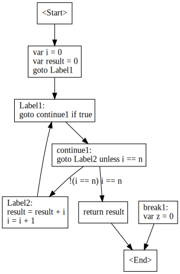

# Episode 14

[Video](https://www.youtube.com/watch?v=5813y1T8lhc&list=PLRAdsfhKI4OWNOSfS7EUu5GRAVmze1t2y&index=14) |
[Pull Request](https://github.com/terrajobst/minsk/pull/66) |
[Previous](episode-13.md) |
[Next](episode-15.md)

## Completed items

We added support for `return` statements and control flow analysis.

## Interesting aspects

### To parse or not to parse

In case of functions without a return type (i.e. procedures), the `return`
keyword can be used to exit it. In case of functions, the `return` keyword
must be followed with an expression. So syntactically both of these forms
are valid:

```
return
return 1 * 2
```

This begs the question if after seeing a `return` keyword an expression needs to
be parsed.

In a language that has a token that terminates statements (such as the semicolon
in C-based languages) it's pretty straight forward: after seeing the `return`
keyword, an expression is parsed unless the next token is a semicolon. That's
what [C# does too][roslyn-return].

But our language doesn't have semicolons. So what can we do? You might think we
could make the parser smarter by trying to parse an expression, but this would
still be ill-defined. For example, what should happen in this case:

```
return
someFunc()
```

Is `someFunc()` supposed to be the return expression?

I decided to go down the (arguably problematic) path JavaScript took: if the
next token is on the same line, we [parse an expression][parse-return].
Otherwise, we don't.

[roslyn-return]: https://github.com/dotnet/roslyn/blob/b5cd612b741668145ad50bb4329a4de94af48490/src/Compilers/CSharp/Portable/Parser/LanguageParser.cs#L7946-L7949
[parse-return]: https://github.com/terrajobst/minsk/blob/a82c3f875802f82b40f933460f767da00449cae2/src/Minsk/CodeAnalysis/Syntax/Parser.cs#L301-L310

### Returning is simple but validation is hard

Implementing the `return` keyword is [pretty straight forward][return-commit].
What's harder is to decide whether all control flows through a function end in a
return statement.

You might think this can be done by walking backwards through the statments, but
it's not that easy. Consider this code:

```typeScript
function sum(n: int): int
{
    var i = 0
    var result = 0
    while true
    {
        if (i == n) return result
        result = result + i
        i = i + 1
    }
    var z = 0
}
```
The statement `var z = 0` isn't followed by a return statement. However, all
flows through the function end up in returning a value -- this statement is
simply unreachable.

How do we know this? The approach is called [control flow
analysis][control-flow]. The idea is that we create a graph that represents the
control flow of the function. For our example it roughly looks like this:



All nodes in the graph are called [basic blocks][basic-block]. A basic block is
a list of statements that are executed in sequence without any jumps. Only the
first statement in a basic block can be jumped to and only the last statement
can transfer control to other blocks. All edges in this graph represent branches
in control flow.

All control flow graphs have a single `<Start>` and a single `<End>` node. Thus,
empty functions would have two nodes.

To check wether a function always returns a value, we only have to start at the
`<End>` node and check whether all incoming blocks end with a `return
statement`, ignoring blocks that are unreachable. A node is considered
unreachable if it doesn't have any incoming nodes or all incoming nodes are also
considered unreachable.

To simplify our lives, we [remove all unreachable nodes][remove-unreachable] so
that [checking returns][check-returns] doesn't have to exclude them.

[return-commit]: https://github.com/terrajobst/minsk/commit/26d79f8f1e0b30a45405daa25ca0230642de2fa9
[control-flow]: https://en.wikipedia.org/wiki/Control_flow
[basic-block]: https://en.wikipedia.org/wiki/Basic_block
[remove-unreachable]: https://github.com/terrajobst/minsk/blob/a82c3f875802f82b40f933460f767da00449cae2/src/Minsk/CodeAnalysis/Binding/ControlFlowGraph.cs#L201-L209
[check-returns]: https://github.com/terrajobst/minsk/blob/a82c3f875802f82b40f933460f767da00449cae2/src/Minsk/CodeAnalysis/Binding/ControlFlowGraph.cs#L308-L320
